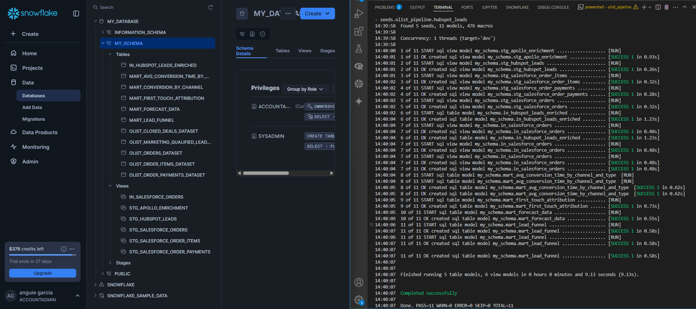
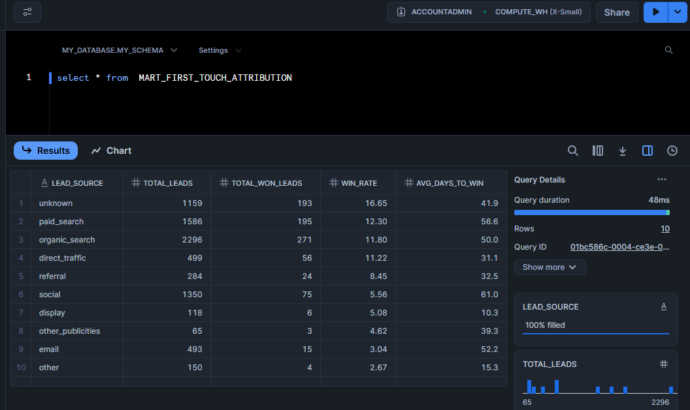

<div style="text-align: center;">
  
</div>

### **Please check the summary report [here](https://github.com/AnguieGarciaB/Cobre/blob/main/SummaryReport.pdf)**

---

# Data Modeling & Integration: Conceptual Model and Simplified Pipeline

## Objective

The goal of this task is to design a **conceptual data model** that integrates data from various sources—**marketing (HubSpot)**, **enrichment (Apollo)**, and **CRM (Salesforce)**—to provide a unified view of **leads, marketing sources, enrichment metadata, and conversion outcomes**. This data model will serve as the foundation for analytics, enabling insights into the entire customer journey, from initial engagement to conversion.


## Conceptual Data Model

The data model unifies different datasets from multiple sources into a cohesive structure, enabling the tracking and analysis of leads at various stages. The main entities in the model include:

- **Leads:** Marketing Qualified Leads (MQLs) generated from marketing campaigns (e.g., HubSpot).
- **Enrichment Data:** Additional customer metadata (e.g., Apollo), enriching the lead profiles with data like company information, job titles, and decision-makers.
- **Conversions:** Data on leads that converted into customers, including closed deals and transaction details (e.g., Salesforce).
- **Orders and Payments:** Finalized transactions, including order items and payments made by customers.

These entities will be integrated into a **Snowflake** data warehouse, enabling seamless querying and analysis.


## Simplified dbt Pipeline

The integration process is simulated using **dbt (Data Build Tool)**, which facilitates the transformation and modeling of data directly within Snowflake. Here's an overview of the dbt pipeline:

1. ### **Source Data Integration:**
   - **HubSpot → Snowflake:** Loads Marketing Qualified Leads (MQLs) from HubSpot via the `olist_marketing_qualified_leads_dataset.csv` file.
   - **Apollo → Snowflake:** Loads enrichment data from Apollo using the `olist_closed_deals_dataset.csv` file, which contains information on closed deals and conversion metadata.
   - **Salesforce → Snowflake:** Loads Salesforce data, including order details, products, and payments, from the `olist_orders_dataset.csv`, `olist_order_items_dataset.csv`, and `olist_order_payments_dataset.csv` files.

   In a real environment, this would be done with ETL tools (Fivetran, Airbyte, etc.), but here dbt seed serves that role of simulation.

2. ### **Olist pipeline:**
   - The `dbt_project.yml` file is used to configure these datasets as **`seeds`** within DBT. This ensures the CSV files are automatically loaded into Snowflake as tables, ready for analysis.

    The olist_pipeline project follows a well-organized three-layer structure:

    - The **Staging layer** processes raw data, standardizing columns for ease of use.
    - The **Intermediate layer** applies business logic, joins, and enrichment to the data.
    - The **Marts layer** creates business models and aggregates key metrics that are ready for analysis.
   

     By using DBT to automate these processes, the project ensures that the data is clean, well-organized, and ready for in-depth analysis. Models in the Marts layer, such as conversion time, first touch attribution, and lead funnel metrics, provide valuable insights into sales and marketing performance.


3. ### **SQL Files Overview:**
    

    - **Staging Layer**:
        - `staging_hubspot_leads.sql` -> olist_marketing_qualified_leads_dataset
        - `staging_apollo_enrichment.sql` -> olist_closed_deals_dataset
        - `staging_salesforce_orders.sql`-> olist_orders_dataset
        - `staging_salesforce_order_items.sql` -> olist_order_items_dataset
        - `staging_salesforce_order_payments.sql` -> olist_order_payments_dataset

        *Key Operations*:
        
        - Loading data from CSVs (seeds) or raw source systems.
        - Standardizing column names, types, and formats.
        - Removing duplicates.
        - Handling missing data (e.g., setting defaults or using imputation).

    - **Intermediate Layer**:
        - `in_hubspot_leads_enriched.sql` The purpose of this file is to enrich HubSpot leads with apollo enrichment data. Generates an enriched dataset, ready for aggregation and further analysis in the Marts Layer.
        
            *Key Operations*
            - **Conversion Metrics**: Calculates `days_to_conversion` using `DATEDIFF`, and adds a binary flag `is_won` to indicate lead conversion success.
            - **Data Joins**: Joins HubSpot leads data with enrichment datasets (business segments, lead types, and business types) to fill in missing information.

        - `salesforce_order.sql` This file aggregates and enriches Salesforce order data to capture transaction-level details, including purchase timestamps, payment data, and order status.

            *Key Operations*
            - **Order Data Extraction**: Selects important fields.
            - **Join with Order Items**: Joins the `order_items` table to extract product-specific details.
            - **Payment Data**: Includes the `total_payment` from the Salesforce order payments table.

           
    - **Mart Layer**:
        - `mart_avg_conversion_time_by_channel_and_type.sql`
            This file aggregates and calculates the average conversion time for leads based on marketing channels, providing insights into the performance of various marketing strategies.

        - `mart_first_touch_attribution.sql` 

             This file calculate and displays the lead source attribution metrics for the leads. Specifically, it is determining how leads perform based on their first touchpoint (the initial source of the lead, typically indicated by the lead_source field)

        - `mart_forecast_data.sql` The purpose of this file is to aggregate historical data for training forecasting models, focusing on conversion rates and lead volumes to predict future performance.

        - `mart_lead_funnel.sql` This file monitors and compiles metrics for each stage of the sales funnel, providing a clear view of the sales pipeline and highlighting potential bottlenecks. It is organized by lead source.

        - `mart_lead_funnel_total.sql` This file tracks and aggregates metrics for each stage of the sales funnel, helping to visualize the sales pipeline and identify bottlenecks.

Result:
<div style="text-align: center;">
  
</div>


---

# Funnel & Attribution Analytics

## Objective
Calculate conversion rates across stages of the funnel (e.g., MQL → SQL → Won). Implement an attribution model (first-touch, logistic regression, or Markov chain) to assign credit to marketing channels. Evaluate which sources bring in the most valuable or fastest-converting leads.

## Funnel Analytics
`mart_lead_funnel.sql` contains the data to build the funnel.


## Attribution Model
`mart_first_touch_attribution.sql` calculates attribution using the first-touch methodology. `notebooks/attribution_model.ipynb` shows the code used to assign credit to marketing channels using logistic regression. A Markov Chain model is not applicable in this case because there is only one channel per lead (no multiple touchpoints).


| Model            | Ideal Use Case                                                        |
|------------------|------------------------------------------------------------------------|
| First-Touch      | Fast, simple, useful when there's only one channel per lead            |
| Logistic         | To understand probabilities and explain causality           |

In this case, there is only one interaction or conversion associated with a single channel per mql_id, so more complex models like Markov Chain aren't necessary.


### **First-Touch**

- The data is grouped by `lead_source`.
- count(*) as total_leads: Counts the total number of leads for each lead source.
- Count the number of leads that have a date in `won_date`, indicating that these leads were converted (i.e., they were won or closed).
- Calculates the conversion rate, or win rate, i.e., the percentage of leads that converted into customers (`won_date` is not NULL) relative to the total number of leads. The formula is:
  
  ```plaintext
  Win Rate = (Total Won Leads / Total Leads) * 100
  ```
- Calculate the average number of days it took for a lead to convert into a customer. The formula is:

  ```plaintext
  Average Days to Win = (Sum of Days from First Contact to Win) / (Total Number of Leads)
  ```

Result:
<div style="text-align: center;">
  
</div>

### **Logistc Regression**
- Create Binary Columns for Lead Behaviors: The next step is to create binary columns for each behavior type associated with a lead. These behaviors are identified by strings like 'LEAD_cat', 'LEAD_eagle', 'LEAD_wolf', and 'LEAD_shark'. For each lead, a new column is added where the value is `1` if the lead exhibits that particular behavior, and `0` otherwise.
- Create Dummy Variables for Lead Source and Type: The categorical columns `LEAD_SOURCE` and `LEAD_TYPE` are converted into dummy variables. Dummy variables represent each category as a separate binary column, which allows the model to process categorical data. The `drop_first=True` option ensures that one of the categories is dropped to avoid redundancy in the analysis.
- Define Features (X) and Target (y): The features (`X`) are defined as the set of columns that represent the lead's behaviors, source, and type. The target variable (`y`) is the `CONVERTED` column, which indicates whether the lead has been converted or not. These variables are then split into training and testing sets.
- Split Data into Training and Testing Sets
- Train a Logistic Regression Model
- Make Predictions and Evaluate the Model
- Feature Importance: The features with the highest coefficients (weights) are considered the most influential in the model's decision-making process. This helps identify which lead behaviors or sources are most significant in predicting lead conversion.

You can check the notebook for this project [here](https://github.com/AnguieGarciaB/Cobre/tree/business-case/notebooks/attribution_model_logistic_regression.ipynb).


# Forecasting & Planning

📌 **Justification based on the graph:**

1. **Abrupt level shift (structural change)**  
   The number of leads and conversions jumps suggesting a non-linear change in behavior.   
   ➡️ Prophet handles these trend changes well with its automatic "changepoints" feature.

2. **Non-linear trend and accelerated growth**  
   The trend is not smooth or linear: it grows slowly at first, then spikes, and finally stabilizes.  
   ➡️ Prophet allows for piecewise linear trends (segments of different slopes), which is perfect for this pattern.

3. **Possible weekly seasonality**  
   Although not obvious in the graph, there may be hidden weekly or monthly seasonal effects.  
   ➡️ Prophet includes automatic seasonality (daily, weekly, yearly), and custom seasonality can be added if needed.

4. **Outliers or atypical values**  
   The last week shows a sharp drop, which could be an error or an atypical behavior.  
   ➡️ Prophet is robust to outliers and prevents them from distorting the forecast.

🔹 **Simple regression with trend**  
   - Doesn't capture structural changes well.  
   - Does not model seasonality automatically.  
   - Relies on fixed linear relationships.

   This model allows to capture information on other variables such as the source of the Lead. It is implemented to obtain insgihts.


You can check the notebook for this project [here](https://github.com/AnguieGarciaB/Cobre/tree/business-case/notebooks/forecasting_prophet.ipynb).


---
# Prompts

Prompts:
*Data Modeling & Integration*

```python
"""
Cobre, a fintech company, needs a data-driven approach to evaluate marketing and sales performance. The goal is to understand which channels lead to the highest-quality and fastest-converting leads, forecast future leads, and optimize marketing efforts based on ROI.

Task Overview:
Design a conceptual data model that unifies leads, marketing sources, enrichment metadata, and conversion outcomes.

Data Models:
Leads Qualified (MQL) Data:
mql_id: Unique ID for the marketing-qualified lead.
first_contact_date: Date of first contact.
landing_page_id: ID of the landing page where the lead signed up.
origin: Source of the lead (e.g., organic, paid).

Leads Closed (Converted Leads) Data:
mql_id: ID of the marketing-qualified lead.
seller_id: ID of the associated seller.
sdr_id: Sales Development Rep ID.
sr_id: Sales Rep ID.
won_date: Date of conversion to a paying customer.
business_segment: Business segment of the lead.
lead_type: Type of lead (Hot, Warm, Cold).
has_company: Whether the lead has a registered company (Yes/No).
has_gtin: Whether the lead has a Global Trade Item Number (Yes/No)."
"""
```

```python
"what could be the best arquitecture of data in dbts snowflake to meet the goal"
```

```python
 "explaining the role and function of each SQL file in the Intermediate Layer as part of your olist_pipeline project. Each explanation is tailored to the SQL files you mentioned: in_hubspot_leads_enriched.sql, salesforce_order.sql, and the models in the Marts Layer."
```


*Funnel & Attribution Analytics*

```python
"I am preparing to create a visualization that answers the following question:
'Which acquisition channels (e.g., paid, organic, email, referral) generate the highest-quality and fastest-converting leads?
"
"""
To address this, I will evaluate and compare channels using the following metrics:
Conversion speed (average days to conversion or win)
Win rate (from total leads to deals won)
Lead quality progression (MQL to SQL to Won conversion rates)

The data includes multiple dimensions:
Lead Source and Lead Type vs. Average Days to Conversion
Lead Source vs. Total Leads, Won Leads, Win Rate, and Avg Days to Win
Lead Source vs. MQL, SQL, Won, and Funnel Conversion Rates

I aim to use these to visualize and identify the most effective and efficient lead sources."""
```

```python
"I have three DataFrames in Python, which are named as follows:
df_avg_conv – contains data related to average conversions.
df_first_att – contains data on the first attempts made in the acquisition process.
df_conversion_rates – contains data on conversion rates across various acquisition channels.
I would like to perform data visualization to answer the question: Which acquisition channels bring in the highest-quality and fastest-converting leads?
Could you please help me with Python code to generate the necessary visualizations to address this question?"
```
*Forecasting & Planning*

```python
""" Develop a Python script to forecast future lead creation or conversion events using historical data. The goal is to apply time-series forecasting models, such as Prophet or ARIMA, as well as regression-based techniques to make future predictions. Additionally, you are required to identify and present trends, seasonality patterns, and potential risks in the projection.

Lead Information:
lead_id: Unique identifier for each lead.
first_contact_date: The date when the lead was first contacted.
landing_page_id: ID of the landing page the lead interacted with, with fallback logic for null values.
lead_source: Source of the lead (with null values handled as 'unknown').
seller_id: ID of the seller associated with the lead.

Conversion Information:
won_date: The date the lead was converted (if applicable).
days_to_conversion: The number of days between the first contact and the conversion (calculated).
is_won: A binary flag indicating whether the lead was converted (1 if won, 0 otherwise).
Enrichment Information (with imputation for missing data):
business_segment: The business segment associated with the lead.
lead_type: Type of lead.
business_type: Type of business.
lead_behaviour_profile: A profile of the lead’s behavior.

Requirements:
Implement a forecasting model to predict future lead conversions or creation events.
Explore both time-series models (such as Prophet or ARIMA) and regression-based models.
Identify key trends and seasonal patterns in the data.
Highlight potential risks in the forecast, considering uncertainty and variations in the data."""
```

*Forecasting & Planning*

```python
"Given the characteristics of the time series graph, which time series model should be used and why? Justify your answer based on the observed behavior."
```